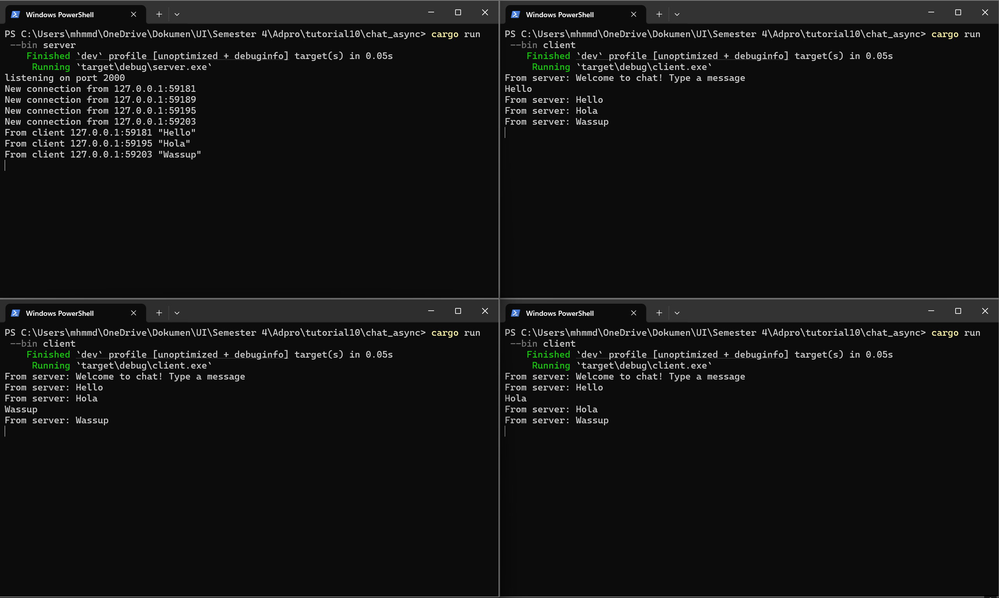
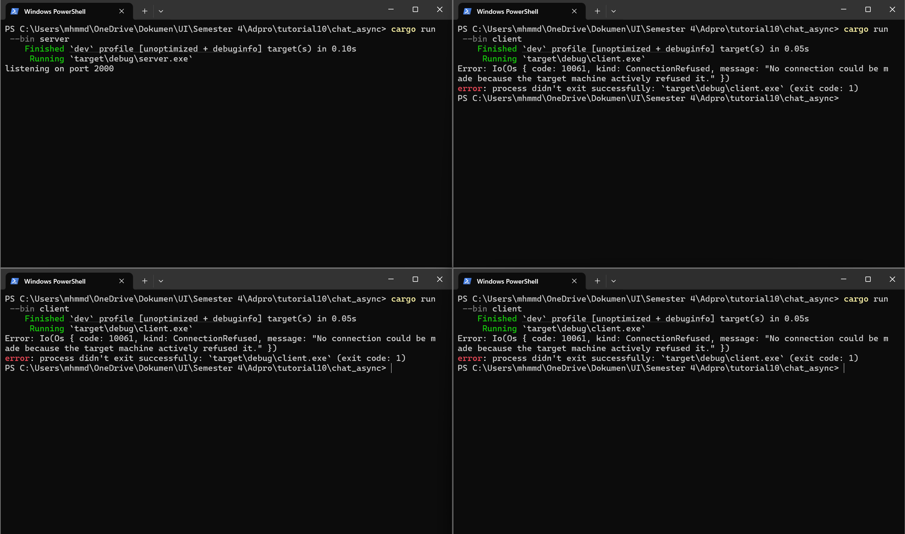
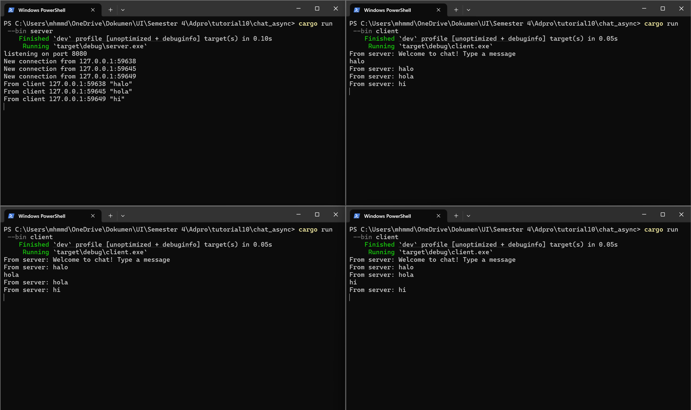
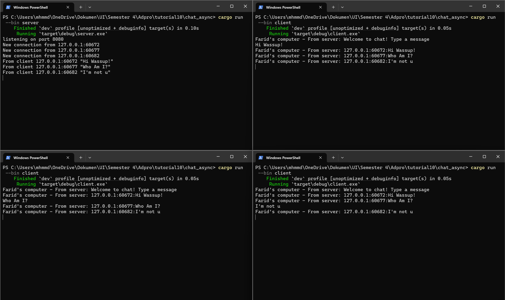

# Module 10 - Broadcast Chat

### 2.1. Original code of broadcast chat

run server : `cargo run --bin server`
run client : `cargo run --bin client`

Dari hasil percobaan tersebut, terlihat jelas bahwa setiap pesan yang dikirimkan oleh satu client akan diterima terlebih dahulu oleh server, lalu server secara otomatis mendistribusikan ulang pesan itu ke semua client yang sedang terhubung, termasuk pengirim asli. Mekanisme ini bekerja karena server menyimpan daftar koneksi client yang aktif dan terus-menerus menunggu input dari salah satu client untuk kemudian menyiarkan kembali pesan tersebut ke seluruh klien yang terhubung.

### 2.2 Modifying the websocket port

Pada skenario ini, server dikonfigurasi untuk menggunakan port 2000, sedangkan klien mencoba terhubung ke WebSocket di port 8080. Karena tidak ada layanan yang berjalan di port 8080, upaya koneksi klien selalu ditolak (ConnectionRefused). Hal tersebut menunjukkan bahwa kedua ujung komunikasi harus mengarah ke port yang sama agar koneksi berhasil.

Setelah port server diubah dari 2000 menjadi 8080, menyesuaikan `TcpListener::bind("127.0.0.1:8080")` dan URI klien diubah menjadi `ws://127.0.0.1:8080`, klien dapat terhubung kembali. Dengan port dan protokol yang sama, semua pesan dari klien berhasil dibroadcast oleh server ke seluruh klien yang terhubung, membuktikan bahwa kesamaan port adalah syarat mutlak untuk komunikasi dua arah dalam aplikasi ini.

### 2.3 Small changes. Add some information to client

Saya menambahkan penyertaan alamat IP dan port pengirim pada setiap pesan broadcast dengan mengganti baris `bcast_tx.send(text.into())?`; menajdi b`cast_tx.send(format!("{addr:?}: {text:?}"))?;` di fungsi handle_connection pada src/bin/server.rs. Setelah perubahan ini, setiap kali server menerima pesan, ia mencetak alamat SocketAddr pengirimnya lalu menyiarkan `addr: message` ke semua klien, sehingga kini tiap klien dapat melihat dari mana pesan tersebut berasal.
